# Projeto de Extensão: Programação Mobile

A proposta do projeto extensionista é colocar em prática tudo o que aprendemos no período, lidando com problemas e demandas reais de uma parte interessada, que deve ser uma empresa real. Nossa parte interessada foi a gráfica da universidade. Conversamos sobre como funcionava o negócio para explorar as opções e possíveis soluções que uma aplicação móvel poderia oferecer. Decidimos desenvolver um simples aplicativo de caixa, que substituiria cadernos personalizados onde eram registradas as vendas.

## Tecnologias Usadas
* [React Native](https://reactnative.dev/)
* [Expo](https://expo.dev/)
* [React Navigation](https://reactnavigation.org/)

***

## Requisitos

Os requisitos levantados foram apenas os necessários para uma possível substituição dos cadernos, de forma que o usuário ainda pudesse registrar os caixas da mesma forma, mas com a praticidade e conveniência de usar um aplicativo móvel:

* O usuário deveria ser capaz de registrar cada dia de caixa individualmente.
* O usuário deveria ser capaz de registrar cada transação individualmente.
* O usuário deveria ser capaz de consultar o saldo do caixa aberto a qualquer momento.
* O usuário deveria ter acesso aos detalhes de todos os caixas já registrados.

Esses foram os pontos que julgamos necessários para entregar o Produto Mínimo Viável.

## Diagrama de Casos de Uso
Um diagrama de casos de uso é uma representação visual que descreve os comportamentos e funcionalidades do sistema, as interações entre os atores (no caso o usuário) e o sistema.

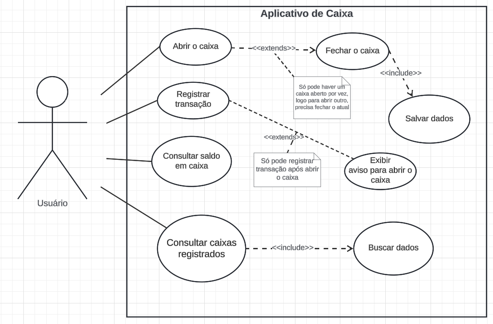

## Fluxos de Evento
Fluxos de Evento são ações que ocorrem em sequência no sistema em resposta a interações.

### Abrir Caixa
* O usuário seleciona a opção de abrir caixa na Home.
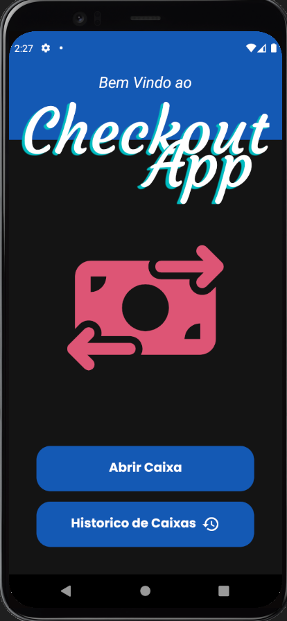
  
* O sistema solicita informações necessárias (dia e caixa inicial).
* O usuário insere as informações.
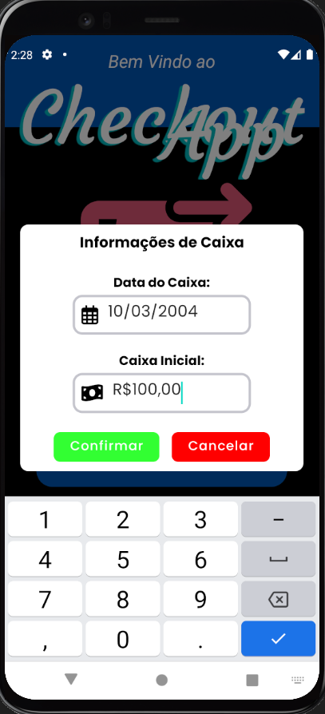

* O sistema verifica se já não há um caixa registrado naquele dia.
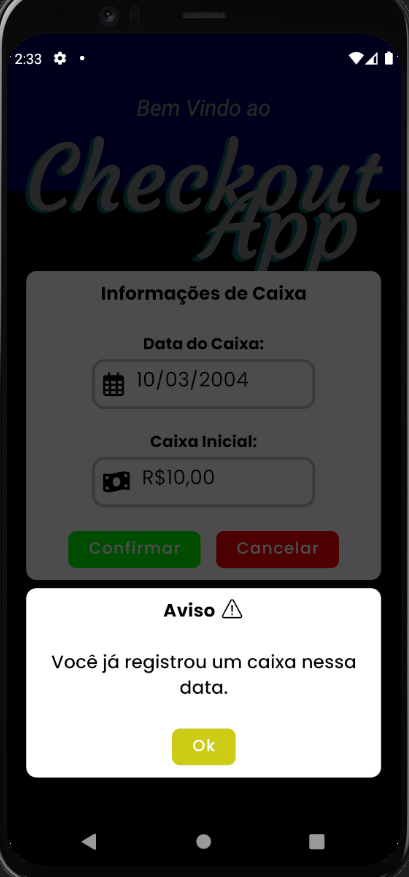

* Redireciona o usuário para tela de gerenciamento de caixa.
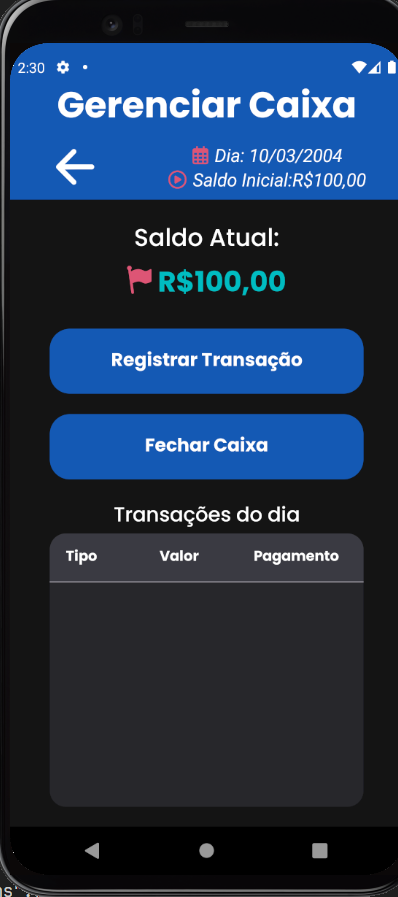

* Substitui a opção de "abrir caixa" por "gerenciar caixa".
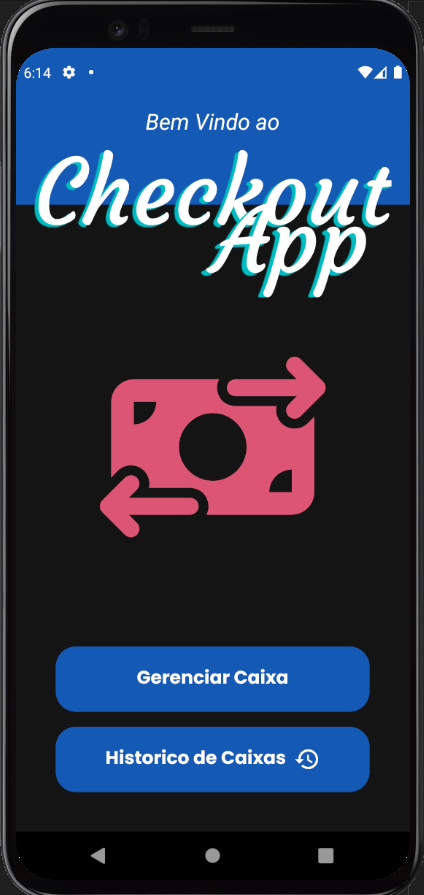

***

### Fechar Caixa
* O usuário seleciona a opção de fechar caixa na tela de gerenciamento.


* Sistema pede confirmação do usuário.
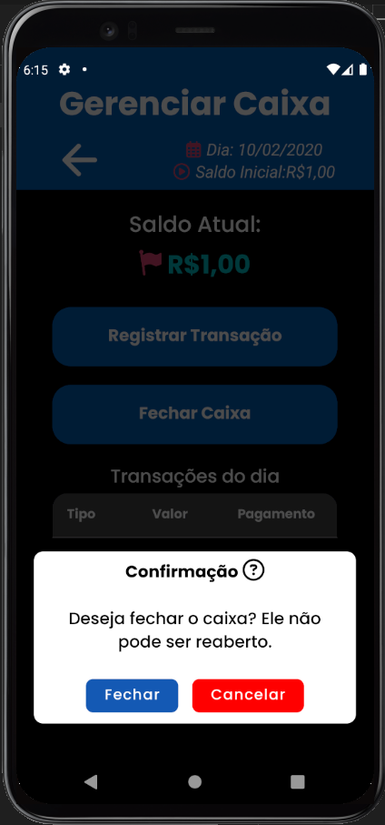

* Os dados do caixa atual são salvos na AsyncStorage.
* Redireciona o usuário para a Home.
* Substitui a opção de "gerenciar caixa" por "abrir caixa".

***

### Registrar transação
* O usuário seleciona a opção de registrar transação na tela de gerenciamento.


* O sistema solicita as informações sobre a transação (tipo da transação, valor e forma de pagamento).
* O usuário preenche o formulário e pressiona o botão de confirmar registro.
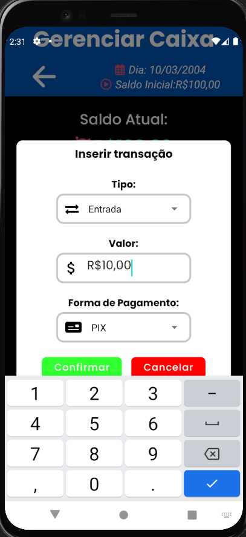

* Um objeto "transação" é criado com as informações fornecidas e salvo no caixa.
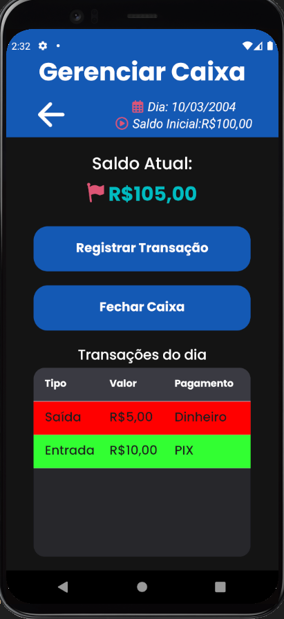

***

### Consultar Caixas Registrados
* O usuário seleciona a opção de histórico de caixas na tela Home.


* O usuário é redirecionado para a tela de histórico de caixas.
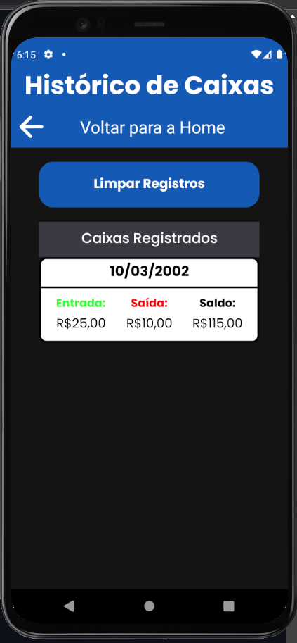

* O usuário pressiona o caixa específico e consulta os detalhes.
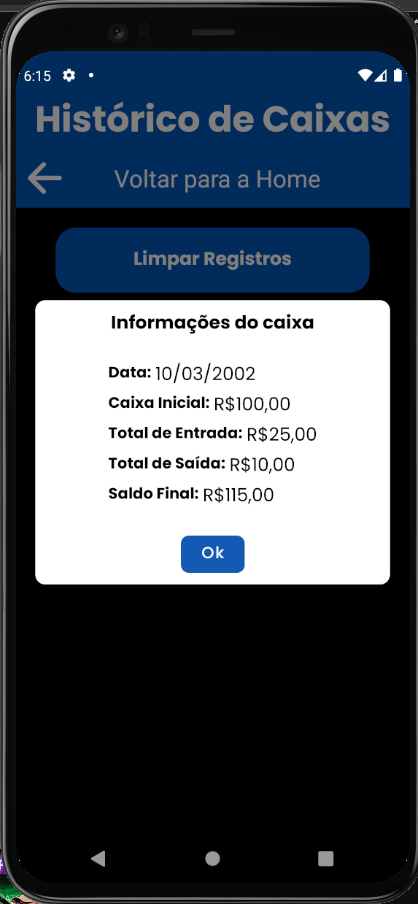

***

## Como rodar o projeto
Para rodar este projeto localmente na sua máquina, sugiro que siga os seguintes passos:

### Pré-Requisito
Antes de tudo, você precisa ter o Node.js e o npm instalados na sua máquina. Caso não os tenha, você pode baixá-los e instalá-los no [site oficial do Node](https://nodejs.org/en/download).

### Clonar o repositório
Você pode clonar o repositório na sua máquina rodando o seguinte comando:
```
git clone https://github.com/gbcayres/Projeto-Extensao-Mobile
```

### Instalar as dependências
Você precisa baixar as dependências necessárias rodando o seguinte comando dentro do diretório do projeto clonado:
```
npm install
```

### Rodar o projeto
Depois de instalar as dependências, você pode iniciar o aplicativo usando o seguinte comando:

```
npx expo start
```


Isso iniciará o servidor de desenvolvimento do Expo. Você pode então escanear o código QR gerado usando o aplicativo Expo Go em seu dispositivo móvel para visualizar o aplicativo em tempo real.
